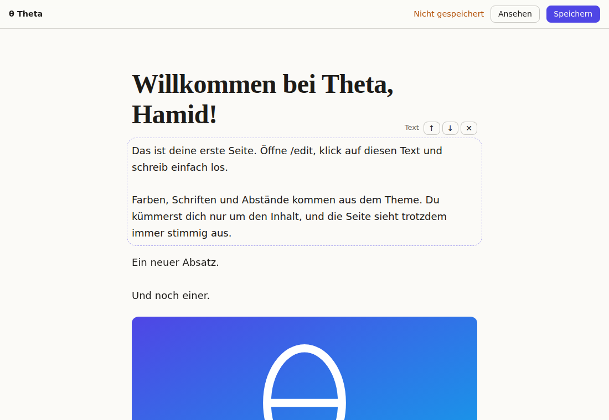

# Theta

Ein einfaches, modernes CMS. Für alle, die eine Website pflegen wollen, ohne programmieren zu können, und für Entwickler, die es erweitern.



## Ausprobieren

Voraussetzung ist [Bun](https://bun.sh).

```sh
bun install
bun run dev
```

Danach zeigt http://localhost:3000 die Website. Beim ersten Start gibt Theta im Terminal einen Einrichtungs-Link aus. Darüber legst du dein Konto an und landest direkt im Editor. Später meldest du dich unter http://localhost:3000/admin an. Dort legst du neue Seiten an, ordnest das Menü und gibst deiner Website einen Namen.

Im Editor klickst du auf einen Text und schreibst los. Mit den Knöpfen oben (oder Strg+B, Strg+I, Strg+K) wird markierter Text fett, kursiv oder zum Link, und aus Zeilen werden Aufzählungen oder nummerierte Listen. Gespeichert wird dabei kein HTML, sondern ein kleines, sicheres Textformat (`**fett**`, `*kursiv*`, `[Link](/adresse)`, `- Liste`), das auch im Export und in der Datenbank lesbar bleibt. Gespeichert wird mit dem Knopf oder mit Strg+S (⌘+S).

Ein Klick auf einen Block wählt ihn aus. Dann erscheinen seine Einstellungen, und über das „+“ an seiner Unterkante fügst du direkt dahinter einen neuen Block ein. Am Griff ⠿ ziehst du Blöcke an eine andere Stelle, mit ⧉ verdoppelst du sie. Lässt sich eine Seite nicht speichern, springt der Editor zum betroffenen Block, markiert ihn und sagt, was fehlt. Unter „Fertige Abschnitte“ fügst du ganze Bausteine auf einmal ein: Angebot in Karten, Über uns, Aufruf, Stimmen, Bildergalerie oder Kontakt. Auch neue Seiten können mit einer Vorlage starten (Startseite, Über uns, Angebot, Kontakt), damit sie nicht leer beginnen.

Passwort vergessen? `bun run theta reset-password deine@adresse.de` setzt ein neues, zufälliges Passwort und zeigt es an.

## Was der Prototyp zeigt

- **Direkt auf der Seite bearbeiten.** Der Editor zeigt die Seite genau so, wie Besucher sie sehen. Texte ändert man an Ort und Stelle, Blöcke lassen sich hinzufügen, verschieben und löschen.
- **Leitplanken statt Stil-Chaos.** Blöcke speichern nur Inhalt. Farben, Schriften und Abstände kommen aus Design-Tokens, deshalb bleibt die Seite immer stimmig. Unter `/admin/design` wählst du eine von drei Vorlagen (Klar, Modern, Warm) und passt Akzentfarbe, Schrift, Abstände, Ecken, Breite und Hell/Dunkel an. Theta warnt bei schlecht lesbaren Farben, wählt die Textfarbe auf Buttons selbst und hellt die Akzentfarbe im Dunkelmodus automatisch auf.
- **Die Website gehört dir.** Alle Inhalte liegen in einer SQLite-Datei (`theta.db`), hochgeladene Bilder im Ordner `uploads/` daneben. Kopieren heißt umziehen. Unter `/admin` lädst du die ganze Website jederzeit als ZIP mit fertigen HTML-Dateien herunter, die bei jedem Webhoster laufen, auch ohne Theta. Im Terminal geht das mit `bun run theta export <Ordner> https://deine-seite.de`.
- **Nichts geht verloren.** Jedes Speichern legt eine Version an. Über „Verlauf“ im Editor holst du eine frühere Version zurück; die letzten 50 pro Seite bleiben erhalten.
- **Schnell ab Werk.** Die öffentliche Seite ist reines HTML und CSS, ganz ohne JavaScript.
- **Bilder ohne Vorarbeit.** Hochgeladene Fotos dreht Theta richtig herum, entfernt Metadaten wie den Aufnahmeort, verkleinert sie auf höchstens 2560 Pixel und erzeugt kleinere WebP-Versionen. Besucher bekommen automatisch die passende Größe.
- **Barrierefreiheit im Blick.** Fehlt einem Bild die Beschreibung, weist der Editor darauf hin.
- **Fußzeile und Logo.** Unter `/admin` lädst du ein Logo aus der Mediathek (es erscheint oben und als Symbol im Browser-Tab), schreibst einen Text für die Fußzeile, etwa Adresse, Öffnungszeiten und Links, und wählst die Seiten für Impressum und Datenschutz. Die stehen dann unten auf jeder Seite statt im Hauptmenü.
- **Gefunden werden.** Jede Seite hat Titel und Beschreibung für Suchmaschinen, eine kanonische Adresse und Vorschau-Daten für geteilte Links. `sitemap.xml` und `robots.txt` erzeugt Theta automatisch.
- **Blog eingebaut.** Unter `/admin/blog` legst du Beiträge an und schreibst sie im selben Editor wie Seiten. Neue Beiträge bleiben Entwürfe, bis du sie veröffentlichst. Dann erscheinen sie mit Datum unter `/blog`, „Blog“ taucht im Menü auf, und Leser können über `/blog/feed.xml` (RSS) folgen. Der Blog ist auch im statischen Export enthalten.

Blöcke: Überschrift, Text, Bild, Galerie, Button, Spalten, Video, Zitat und Trenner. Überschriften gibt es in drei Größen (Seitentitel, Überschrift, kleine Überschrift), die auch für Suchmaschinen und Screenreader richtig gegliedert sind. Bilder können eine Bildunterschrift haben und in Textbreite, breit oder über die ganze Fensterbreite stehen. Buttons, die direkt aufeinander folgen, stehen nebeneinander in einer Reihe. Spalten gibt es als reinen Text oder als Karten mit Bild und optionalem Link („Mehr erfahren →“). Galerien zeigen zwei, drei oder vier Bilder pro Reihe, quadratisch zugeschnitten oder im Originalformat.

Für moderne Seiten gibt es zwei Bausteine über die volle Fensterbreite. Das **Titelbild** zeigt ein großes Foto mit Seitentitel, einem Satz und bis zu zwei Buttons darüber; das Foto wird automatisch abgedunkelt, damit die Schrift lesbar bleibt, und ohne Foto erscheint der Bereich in der Akzentfarbe. Ein **Abschnitt** beginnt einen neuen Bereich mit eigenem Hintergrund (normal, getönt, Akzentfarbe oder Kontrast), der bis zum nächsten Abschnitt reicht. Die Farben kommen aus dem Design, Texte und Buttons passen sich darin von selbst an. Videos von YouTube oder Vimeo laden erst, wenn jemand auf Abspielen klickt; vorher werden keine Daten an die Plattform übertragen.

## Aufbau

| Pfad | Inhalt |
|---|---|
| `src/blocks.ts` | Datenmodell der Blöcke und Prüfung aller Eingaben |
| `src/richtext.ts` | Das Textformat für fett, kursiv, Links und Listen |
| `src/db.ts` | SQLite-Datenbank und Schema-Migrationen |
| `src/store.ts` | Speicherung der Seiten, Blog-Beiträge und Einstellungen |
| `src/auth.ts` | Konten, Passwörter und Anmeldungen |
| `src/media.ts` | Hochgeladene Bilder: Prüfung, Optimierung, kleinere Versionen |
| `src/export.ts`, `src/zip.ts` | Export der Website als statische Dateien bzw. ZIP |
| `src/admin/` | Verwaltung (Seiten, Blog, Mediathek, Design), Anmelde- und Einrichtungsseiten |
| `src/theme/` | Das Theme: Kopfzeile mit Menü, Block-Komponenten, CSS und Design-Tokens (`tokens.ts`) |
| `src/render.tsx` | Rendert öffentliche Seiten, Blog, RSS-Feed, Sitemap und die Editor-Seite auf dem Server |
| `src/editor/` | Der Editor im Browser (React) |
| `src/server.ts` | HTTP-Server mit Hono |

Theme-Komponenten laufen an beiden Stellen: auf dem Server für die öffentliche Seite und im Browser für den Editor. So sehen beide Ansichten immer gleich aus.

## Einstellungen

| Variable | Standard | Bedeutung |
|---|---|---|
| `PORT` | `3000` | Port des Servers |
| `THETA_HOST` | `127.0.0.1` | Adresse, auf der der Server lauscht |
| `THETA_DB` | `theta.db` | Pfad zur SQLite-Datei |
| `THETA_UPLOADS` | `uploads` neben der Datenbank | Ordner für hochgeladene Bilder |
| `THETA_URL` | | Öffentliche Adresse, z. B. `https://meine-seite.de`, wenn Theta hinter einem Proxy läuft |

## Noch nicht enthalten

Plugins kommen noch. Der Server lauscht standardmäßig nur auf dem eigenen Rechner. Für den Betrieb im Internet setzt du `THETA_HOST=0.0.0.0` und stellst einen Proxy mit HTTPS davor.

## Entwicklung

```sh
bun test           # Tests
bun run typecheck  # Typprüfung
```
