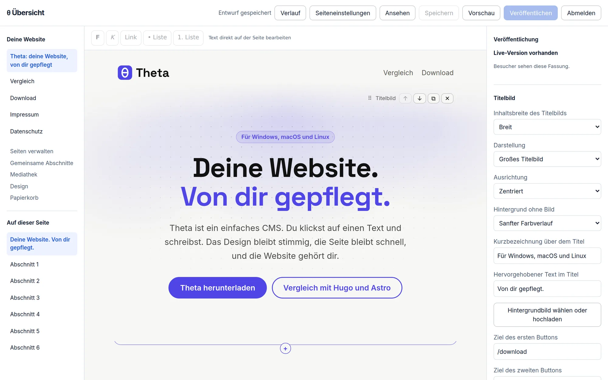
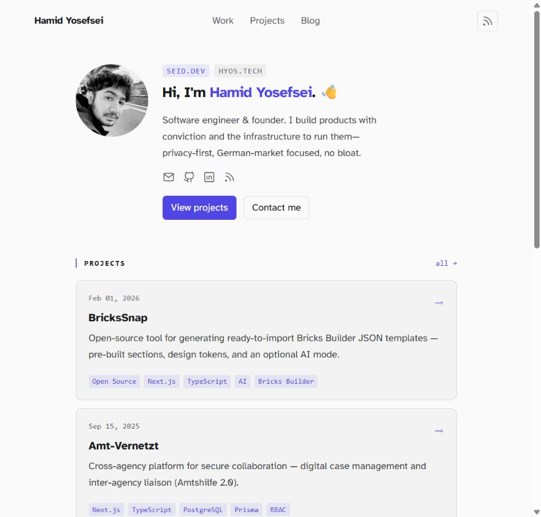

# Theta

Ein einfaches, modernes CMS. Für alle, die eine Website pflegen wollen, ohne programmieren zu können, und für Entwickler, die es erweitern.

**Hugo und Astro sind für Leute, die Websites bauen. Theta ist für Leute, die ihre Website selbst pflegen.**

| | Hugo | Astro | Theta |
|---|---|---|---|
| Texte ändern | Datei bearbeiten, neu bauen | Code oder Datei bearbeiten, neu bauen | Auf der Seite klicken und tippen |
| Design | Theme programmieren | Komponenten programmieren | Vorlage wählen, Regler einstellen |
| JavaScript für Besucher | keins | keins, außer gewollt | keins |
| Kontaktformular, Karte, Blog | selbst bauen oder Fremddienst | selbst bauen oder Fremddienst | eingebaut, ohne Fremddienste |
| Installation | Programm und Terminal | Node und Terminal | Herunterladen und doppelklicken |

Noch nicht enthalten sind Plugins und mehrsprachige Seiten. Wer Tausende Seiten aus Dateien erzeugt und gerne mit Git arbeitet, ist mit Hugo oder Astro gut bedient. Die [Theta-Website](examples/website/README.md) ist selbst mit Theta gebaut und erklärt den Unterschied ausführlicher.



## Ausprobieren

**Ohne Terminal:** Lade unter [Releases](https://github.com/Hamido212/Theta/releases) die ZIP für dein System herunter (Windows, macOS mit Apple-Chip, Linux), entpacke sie und starte `theta` mit einem Doppelklick (unter Linux im Terminal mit `./theta`). Der Browser öffnet sich mit der Einrichtung. Deine Daten liegen im Ordner `theta-daten` neben dem Programm. Weil das Programm noch nicht signiert ist, blockiert macOS den ersten Start: Gib ihn unter Systemeinstellungen → Datenschutz & Sicherheit mit „Trotzdem öffnen“ frei oder entferne die Sperre für den ganzen Ordner einmal im Terminal mit `xattr -dr com.apple.quarantine <Ordner>`. Unter Windows klickst du bei SmartScreen auf „Weitere Informationen“ und „Trotzdem ausführen“. Die `LIESMICH.txt` in der ZIP erklärt das für dein System.

**Auf einem Server mit Docker:**

```sh
docker run -d -p 3000:3000 -v theta-daten:/data ghcr.io/hamido212/theta
docker logs <Container>   # zeigt den Einrichtungs-Link
```

Datenbank, Bilder und Sicherungen liegen im Volume `/data`. Für den Betrieb im Internet setzt du `-e THETA_URL=https://deine-seite.de` und stellst einen Proxy mit HTTPS davor.

**Zum Entwickeln** brauchst du [Bun](https://bun.sh):

```sh
bun install
bun run dev
```

Danach zeigt http://localhost:3000 die Website. Beim ersten Start gibt Theta im Terminal einen Einrichtungs-Link aus. Darüber legst du dein Konto an und landest direkt im Editor. Später meldest du dich unter http://localhost:3000/admin an. Dort legst du neue Seiten an, ordnest das Menü und gibst deiner Website einen Namen.

Im Editor klickst du auf einen Text und schreibst los. Mit der Formatierungsleiste (oder Strg+B, Strg+I, Strg+K) wird markierter Text fett, kursiv oder zum Link, und aus Zeilen werden Aufzählungen oder nummerierte Listen. Gespeichert wird dabei kein HTML, sondern ein kleines, sicheres Textformat (`**fett**`, `*kursiv*`, `[Link](/adresse)`, `- Liste`), das auch im Export und in der Datenbank lesbar bleibt. Nach einer Sekunde ohne Änderungen speichert Theta automatisch den Entwurf. Mit „Speichern“ oder Strg+S (⌘+S) sicherst du ihn sofort. Erst „Veröffentlichen“ übernimmt den aktuellen Entwurf auf die öffentliche Website; bis dahin sehen Besucher die bisherige Fassung. „Vorschau“ öffnet den gespeicherten Entwurf in einer geschützten Ansicht, für die du angemeldet sein musst.

Links wechselst du zwischen Seiten und Abschnitten, in der Mitte bearbeitest du die Website, rechts erscheinen die Einstellungen des ausgewählten Blocks. Auf kleinen Bildschirmen blendest du die Seiten- oder Einstellungsleiste mit den Knöpfen oben ein. Über das „+“ an der Unterkante eines Blocks fügst du direkt dahinter einen neuen Block ein. Am Griff ⠿ ziehst du Blöcke an eine andere Stelle, mit ⧉ verdoppelst du sie. Lässt sich eine Seite nicht speichern, markiert Theta den betroffenen Block und sagt, was fehlt. Hat eine andere Sitzung die Seite geändert, stoppt Theta das Speichern und behält deinen lokalen Text im geöffneten Editor. Prüfe und kopiere ihn bei Bedarf, bevor du ausdrücklich den Serverstand lädst.

Der Speicherstatus berücksichtigt auch Text, den du während einer laufenden Speicherung eingibst. Nach vier Sekunden erklärt Theta eine langsame Antwort; nach 15 Sekunden endet eine unbeantwortete Anfrage mit einem Hinweis zum erneuten Speichern. Eine verspätete Antwort bestätigt keinen neueren Entwurf. Wenn der Server die Änderung bereits übernommen hat, aber seine Antwort verloren ging, schützt die Versionsprüfung beim nächsten Versuch den Serverstand.

Unter „Fertige Abschnitte“ fügst du ganze Bausteine auf einmal ein: Angebot in Karten, Über uns, Aufruf, Stimmen, Bildergalerie, Preise, Team, Häufige Fragen oder Kontakt. Ein ausgewählter Abschnitt wird samt Inhalt bis zum nächsten Abschnitt verschoben, verdoppelt oder gelöscht. Seine Breite, Abstände und Ausrichtung wählst du aus festen Vorgaben. Über „Als Vorlage behalten“ speicherst du ihn für weitere Seiten; jede Verwendung erzeugt eine unabhängige Kopie. Auch neue Seiten können mit einer Vorlage starten (Startseite, Über uns, Preise oder Speisekarte, Angebot, Kontakt), damit sie nicht leer beginnen.

Die Abschnittsauswahl hat eine Suche und die Kategorien „Agentur“, „Allgemein“ und „Eigene Vorlagen“. Für Agenturen gibt es sieben zusammenpassende Abschnitte für Einstieg, Leistungen, Projekte, Ablauf, Vorstellung, FAQ und Kontakt sowie vier vollständige Seitenvorlagen. Sie enthalten bearbeitbare Strukturen; Projektbilder, Beschreibungen und Kontaktziele ergänzt du selbst. Beim Titelbild wählst du Textbreite, breite Inhalte oder die ganze Fensterbreite. Titelbild und Abschnitte verwenden dieselben Seitenabstände, auch auf dem Handy.

Unter `/admin/shared-sections` legst du **gemeinsame Abschnitte** an, etwa eine Projektanfrage für mehrere Seiten. Alternativ wählst du einen vorhandenen Abschnitt und nutzt „Als gemeinsamen Abschnitt anlegen“. Er startet als eigener Entwurf mit Verlauf und Versionsprüfung. Öffne „Zentral bearbeiten“ und veröffentliche ihn, bevor du eine Seite mit seiner Einbindung veröffentlichst. Danach findest du ihn in der Blockauswahl unter „Gemeinsame Abschnitte“.

**Veröffentlichen in der zentralen Bearbeitung aktualisiert alle eingebundenen öffentlichen Seiten und Beiträge sofort.** Bloßes Speichern bleibt privat. Die Verwaltung zeigt die verwendenden Seiten; ein noch verwendeter Abschnitt lässt sich weder löschen noch zurückziehen. „In unabhängige Kopie umwandeln“ löst eine Einbindung auf Basis ihrer veröffentlichten Fassung; veröffentliche danach die Seite, um auch die Live-Einbindung zu entfernen. Geschützte Seitenvorschauen und der HTML-Export verwenden ebenfalls die veröffentlichte zentrale Fassung. Die Vorschau des zentralen Abschnitts selbst zeigt seinen gespeicherten Entwurf.

Passwort vergessen? `bun run theta reset-password deine@adresse.de` setzt ein neues, zufälliges Passwort und zeigt es an. Im heruntergeladenen Programm heißt der Befehl `./theta reset-password deine@adresse.de` (Windows: `.\theta.exe reset-password …`), mit Docker `docker exec <Container> bun src/cli.ts reset-password deine@adresse.de`. Genauso gibt es `backup`, `restore` und `export`; `hilfe` zeigt alle Befehle.

## Beispiel: seid.dev in Theta

`bun run demo:seid` startet einen bearbeitbaren Nachbau von [seid.dev](https://seid.dev/) unter http://127.0.0.1:3108. Er enthält das Profil, vier Projekte samt Detailseiten, den Arbeitsverlauf, einen Blogbeitrag und die rechtlichen Seiten. Die Demo nutzt eine eigene Datenbank und Mediathek in `examples/seid/data/`; deine reguläre Theta-Website wird nicht verändert. Beim ersten Start legst du über den Einrichtungs-Link im Terminal dein eigenes Konto an.



Start, Bearbeitung, Export und Unterschiede zum Original sind in [examples/seid/README.md](examples/seid/README.md) beschrieben.

## Was der Prototyp zeigt

- **Direkt auf der Seite bearbeiten.** Der Editor zeigt die Seite genau so, wie Besucher sie sehen. Texte ändert man an Ort und Stelle, Blöcke lassen sich hinzufügen, verschieben und löschen.
- **Leitplanken statt Stil-Chaos.** Blöcke speichern nur Inhalt. Farben, Schriften und Abstände kommen aus Design-Tokens, deshalb bleibt die Seite immer stimmig. Unter `/admin/design` wählst du eine von fünf Vorlagen (Klar, Modern, Warm, Studio, Portfolio) und passt Akzentfarbe, Schrift, Abstände, Ecken, Breite und Hell/Dunkel an. Neben den Schriften des Geräts bringt Theta fünf freie Schriften mit (Inter, Fraunces, Lora, Space Grotesk und Atkinson, SIL Open Font License). Die Website liefert sie selbst aus, nur die tatsächlich gewählten, und nie über fremde Server wie Google Fonts. Theta warnt bei schlecht lesbaren Farben, wählt die Textfarbe auf Buttons selbst und hellt die Akzentfarbe im Dunkelmodus automatisch auf.
- **Die Website gehört dir.** Alle Inhalte liegen in einer SQLite-Datei (`theta.db`), hochgeladene Bilder im Ordner `uploads/` daneben. Unter `/admin` lädst du die veröffentlichte Website als ZIP mit fertigen HTML-Dateien herunter, die bei jedem Webhoster laufen, auch ohne Theta. Im Terminal geht das mit `bun run theta export <Ordner> https://deine-seite.de`. Dieser HTML-Export enthält nur öffentliche Fassungen; Entwürfe, Verlauf, Konten und eigene Vorlagen bleiben in der Datenbank.
- **Sichern und umziehen.** Unter `/admin` lädst du mit „Sicherung herunterladen“ eine ZIP mit allem herunter, was zur Website gehört: Seiten mit Entwürfen und Verlauf, Papierkorb, Bilder, Design, Vorlagen, Nachrichten und Konten. Das geht auch, während jemand bearbeitet. Mit „Sicherung einspielen“ holst du einen früheren Stand zurück; Theta legt vorher den jetzigen Stand im Ordner `sicherungen/` neben der Datenbank ab, und danach meldest du dich neu an. Auf einem neuen Rechner bietet schon die Einrichtungsseite „Umzug von einem anderen Rechner?“ an, statt ein neues Konto anzulegen. Im Terminal geht das mit `bun run theta backup [Datei.zip]` und, bei gestopptem Server, `bun run theta restore <Datei.zip> --ja`. Bewahre Sicherungen gut auf: Sie enthalten Nachrichten von Besuchern und ein eingetragenes E-Mail-Passwort. Anmeldungen sind nicht enthalten.
- **Bewusst veröffentlichen.** Neue Seiten und Beiträge starten als Entwurf. Seitentitel, Beschreibung, Menü-Sichtbarkeit und Inhalt werden gemeinsam veröffentlicht. Öffentliche Navigation, RSS, Sitemap und Export verwenden diese Live-Fassung. Änderungen am Design und an den allgemeinen Website-Einstellungen werden direkt übernommen.
- **Verlauf und Papierkorb.** Inhaltliche Speicherungen halten bis zu 50 Fassungen je Seite fest. Autosaves derselben Person werden innerhalb von fünf Minuten gebündelt; manuelles Speichern und Veröffentlichen bilden Grenzen. Über „Verlauf“ stellst du eine frühere Fassung als gespeicherten Entwurf wieder her. Theta sichert vorher auch noch nicht gespeicherte Eingaben; der Stand vor dem Wechsel bleibt im Verlauf. Besucher sehen weiterhin die Live-Fassung, bis du ausdrücklich veröffentlichst. Gelöschte Seiten und Beiträge landen im Papierkorb und lassen sich als Entwurf wiederherstellen. Ihre Adresse bleibt reserviert. Bilder aus Entwürfen, Live-Fassungen, Verlauf, Papierkorb und eigenen Vorlagen werden vor dem Löschen geschützt.
- **Schnell ab Werk.** Die öffentliche Seite ist reines HTML und CSS, ganz ohne JavaScript.
- **Bilder ohne Vorarbeit.** Hochgeladene Fotos dreht Theta richtig herum, entfernt Metadaten wie den Aufnahmeort, verkleinert sie auf höchstens 2560 Pixel und erzeugt kleinere WebP-Versionen. Besucher bekommen automatisch die passende Größe. Bei Titelbildern, Bildern, Karten und Galerien setzt du einen Fokuspunkt per Klick oder Pfeiltasten. Vorschauen in drei Formaten zeigen, wie das Motiv beim Zuschneiden erscheint.
- **Barrierefreiheit im Blick.** Fehlt einem Bild die Beschreibung, weist der Editor darauf hin.
- **Fußzeile und Logo.** Unter `/admin` lädst du ein Logo aus der Mediathek (es erscheint oben und als Symbol im Browser-Tab), schreibst einen Text für die Fußzeile, etwa Adresse, Öffnungszeiten und Links, und wählst die Seiten für Impressum und Datenschutz. Die stehen dann unten auf jeder Seite statt im Hauptmenü.
- **Gefunden werden.** Jede Seite hat Titel und Beschreibung für Suchmaschinen, eine kanonische Adresse und Vorschau-Daten für geteilte Links. `sitemap.xml` und `robots.txt` erzeugt Theta automatisch.
- **Kontaktformular ohne fremde Dienste.** Der Block „Kontaktformular“ fragt Name, E-Mail, Nachricht und auf Wunsch die Telefonnummer ab. Jede Nachricht landet unter `/admin/messages` im Postfach der Verwaltung; die Startseite der Verwaltung zeigt, wenn neue da sind. Trägst du dort zusätzlich den Postausgangsserver (SMTP) deines E-Mail-Anbieters ein, kommt jede Nachricht auch per E-Mail, und du antwortest direkt aus deinem Mailprogramm. Das Passwort liegt dafür in der Datenbank und wird nach dem Speichern nie wieder angezeigt; nimm am besten ein eigenes App-Passwort, falls dein Anbieter das anbietet. Gegen Spam helfen ein unsichtbares Fangfeld, eine Mindestzeit zum Ausfüllen, ein signierter Zeitstempel und ein Limit von fünf Nachrichten pro Besucher in zehn Minuten, alles ohne Captcha und ohne JavaScript. Ein Hinweis unter dem Formular verlinkt die gewählte Datenschutzseite. Weil Nachrichten den Theta-Server brauchen, fehlen Formulare im statischen Export.
- **Karte, die erst per Klick lädt.** Der Block „Karte“ zeigt einen Ort auf einer Karte von OpenStreetMap. Den Ort findest du im Editor über die Adresssuche oder indem du einen Link von OpenStreetMap, Google Maps, Apple Maps oder Koordinaten einfügst. Besucher sehen zuerst nur einen Platzhalter mit dem Hinweis, dass beim Laden Daten an OpenStreetMap gehen; erst ein Klick lädt die echte Karte. Darunter führt ein Link zur größeren Karte und zur Routenplanung. Die Adresssuche im Editor fragt den Ortsdienst von OpenStreetMap (Nominatim) über den Theta-Server, Besucher lösen keine Anfrage aus. Die Kontakt-Vorlage enthält eine Karte direkt unter der Adresse.
- **Adressen ändern ohne kaputte Links.** In den Seiteneinstellungen des Editors bekommt eine Seite oder ein Beitrag mit „Ändern“ eine neue Adresse. War die Seite schon veröffentlicht, leitet die alte Adresse dauerhaft (301) auf die neue weiter, damit Links und Suchergebnisse weiter funktionieren; Verlauf und Fußzeilen-Links ziehen mit um. Unter `/admin` legst du außerdem eigene Weiterleitungen an, etwa von Adressen deiner bisherigen Website (`/ueber-uns.html` oder eine komplette alte Adresse) auf die neuen Seiten oder auf andere Websites. Der statische Export enthält eine `_redirects`-Datei für Hoster wie Netlify oder Cloudflare Pages und an jeder alten Adresse eine kleine Seite, die Besucher weiterschickt.
- **Blog eingebaut.** Unter `/admin/blog` legst du Beiträge an und schreibst sie im selben Editor wie Seiten. Neue Beiträge bleiben Entwürfe, bis du sie veröffentlichst. Dann erscheinen sie mit Datum unter `/blog`, „Blog“ taucht im Menü auf, und Leser können über `/blog/feed.xml` (RSS) folgen. Der Blog ist auch im statischen Export enthalten.

Blöcke: Überschrift, Text, Bild, Galerie, Button, Spalten, Video, Zitat, Trenner, Preisliste, Fragen & Antworten, Öffnungszeiten, Team, Kontaktformular und Karte. Überschriften gibt es in drei Größen (Seitentitel, Überschrift, kleine Überschrift), die auch für Suchmaschinen und Screenreader richtig gegliedert sind. Bilder können eine Bildunterschrift haben und in Textbreite, breit oder über die ganze Fensterbreite stehen. Bildschirmfotos bekommen auf Wunsch einen Rahmen wie ein Browserfenster. Buttons, die direkt aufeinander folgen, stehen nebeneinander in einer Reihe. Spalten gibt es als reinen Text oder als Karten mit Bild und optionalem Link („Mehr erfahren →“). Galerien zeigen zwei, drei oder vier Bilder pro Reihe, quadratisch zugeschnitten oder im Originalformat. Die **Preisliste** stellt Name und Preis mit gepunkteter Linie nebeneinander, ideal für Speisekarten und Leistungen. **Fragen & Antworten** klappen per Klick auf, ganz ohne JavaScript. **Öffnungszeiten** erscheinen als übersichtliche Tabelle mit Hinweiszeile, das **Team** als Raster mit runden Fotos, Name und Aufgabe. Leere Einträge bleiben auf der fertigen Seite unsichtbar.

Für moderne Seiten gibt es zwei Bausteine über die volle Fensterbreite. Das **Titelbild** zeigt ein großes Foto mit Seitentitel, einem Satz und bis zu zwei Buttons darüber; das Foto wird automatisch abgedunkelt, damit die Schrift lesbar bleibt, und ohne Foto erscheint der Bereich in der Akzentfarbe oder als sanfter Farbverlauf mit feinem Punktraster. Titel, Text und Buttons stehen links oder zentriert, darüber auf Wunsch eine Kurzbezeichnung, und ein Teil des Titels kann in der Akzentfarbe hervorgehoben sein. Ein **Abschnitt** beginnt einen neuen Bereich mit eigenem Hintergrund (normal, getönt, Akzentfarbe oder Kontrast), der bis zum nächsten Abschnitt reicht. Die Farben kommen aus dem Design, Texte und Buttons passen sich darin von selbst an. Videos von YouTube oder Vimeo laden erst, wenn jemand auf Abspielen klickt; vorher werden keine Daten an die Plattform übertragen.

Das Titelbild hat außerdem die Darstellung **Profil mit Porträt** mit Kurzbezeichnungen, hervorgehobenem Namen und beschrifteten Kontakt-Links. Spalten können als **Karten untereinander** oder **Zeitlicher Verlauf** erscheinen, mit Datum, Tags und Link pro Eintrag, oder als **Kennzahlen** mit großer Zahl und kurzer Erklärung. Diese Ansichten lassen sich wie die anderen Blöcke direkt bearbeiten und funktionieren mit allen Designvorlagen. Unter `/admin` wählst du Deutsch oder Englisch für die öffentliche Website; Datumsangaben, Blog-Texte und RSS passen sich an. Die Bedienoberfläche bleibt deutsch.

## Aufbau

| Pfad | Inhalt |
|---|---|
| `src/blocks.ts` | Datenmodell der Blöcke und Prüfung aller Eingaben |
| `src/richtext.ts` | Das Textformat für fett, kursiv, Links und Listen |
| `src/db.ts` | SQLite-Datenbank und Schema-Migrationen |
| `src/store.ts` | Speicherung der Seiten, Blog-Beiträge und Einstellungen |
| `src/shared-sections.ts` | Prüfung gemeinsamer Abschnitte und Auflösung ihrer veröffentlichten Einbindungen |
| `src/auth.ts` | Konten, Passwörter und Anmeldungen |
| `src/geocode.ts` | Adresssuche für die Karte über OpenStreetMap (Nominatim) |
| `src/redirects.ts` | Weiterleitungen von alten Adressen |
| `src/contact.ts` | Nachrichten aus Kontaktformularen, Spamschutz und E-Mail-Versand per SMTP |
| `src/media.ts` | Hochgeladene Bilder: Prüfung, Optimierung, kleinere Versionen |
| `src/export.ts`, `src/zip.ts` | Export der Website als statische Dateien bzw. ZIP |
| `src/backup.ts` | Vollständige Sicherung (Datenbank und Bilder) und ihre Wiederherstellung |
| `src/admin/` | Verwaltung (Seiten, Blog, Mediathek, Nachrichten, Design), Anmelde- und Einrichtungsseiten |
| `src/theme/` | Das Theme: Kopfzeile mit Menü, Block-Komponenten, CSS und Design-Tokens (`tokens.ts`) |
| `src/render.tsx` | Rendert öffentliche Seiten, Blog, RSS-Feed, Sitemap und die Editor-Seite auf dem Server |
| `src/editor/` | Der Editor im Browser (React) |
| `src/server.ts` | HTTP-Server mit Hono |
| `src/assets.ts`, `src/desktop.ts`, `src/sharp.ts` | Eingebaute Dateien und Start des fertigen Programms |

Theme-Komponenten laufen an beiden Stellen: auf dem Server für die öffentliche Seite und im Browser für den Editor. So sehen beide Ansichten immer gleich aus.

## Einstellungen

| Variable | Standard | Bedeutung |
|---|---|---|
| `PORT` | `3000` | Port des Servers |
| `THETA_HOST` | `127.0.0.1` | Adresse, auf der der Server lauscht |
| `THETA_DB` | `theta.db` | Pfad zur SQLite-Datei |
| `THETA_UPLOADS` | `uploads` neben der Datenbank | Ordner für hochgeladene Bilder |
| `THETA_URL` | | Öffentliche Adresse, z. B. `https://meine-seite.de`, wenn Theta hinter einem Proxy läuft. Das Limit des Kontaktformulars zählt dann pro Adresse, die der Proxy in `X-Forwarded-For` anhängt |

## Noch nicht enthalten

Plugins kommen noch. Der Server lauscht standardmäßig nur auf dem eigenen Rechner. Für den Betrieb im Internet setzt du `THETA_HOST=0.0.0.0` und stellst einen Proxy mit HTTPS davor.

## Entwicklung

```sh
bun test           # Tests
bun run typecheck  # Typprüfung
bun run build      # Programm für diesen Rechner in dist/theta/
```

`bun run build` packt Server, Editor, Stylesheets, Schriften und Bilder in eine einzige Programmdatei (`scripts/build.ts`, Einstieg `src/desktop.ts`). Nur die Bildbibliothek sharp liegt als Ordner `node_modules` daneben, weil sie aus nativen Bibliotheken besteht. Ein Tag wie `v0.1.0` baut über `.github/workflows/release.yml` die Programme für alle Systeme auf deren eigenen Rechnern, hängt sie an ein GitHub-Release und veröffentlicht das Docker-Image unter `ghcr.io/hamido212/theta`. Den Text des Releases schreibst du vorher nach `docs/releases/<tag>.md`, etwa `docs/releases/v0.1.0.md`.

Beim Start aktualisiert Theta ältere Datenbanken automatisch. Bereits öffentliche Seiten und Blogbeiträge bleiben veröffentlicht; bisherige Beitragsentwürfe bleiben privat. Lade vor einem Update eine Sicherung herunter.

Die Speicher-API `PUT /api/pages/:slug` erwartet die zuletzt gelesene numerische `version` und optional `action: "save" | "publish" | "unpublish"` (Standard: `save`). Eine erfolgreiche Antwort enthält die neue Version. Ein veralteter Stand liefert HTTP 409 und verändert keine Inhalte. Die Startseite bleibt veröffentlicht. Der Vergleich mit EmDash und die Umsetzungsliste stehen in [docs/emdash-vergleich.md](docs/emdash-vergleich.md) und [docs/umsetzung-editor.md](docs/umsetzung-editor.md).

Gemeinsame Abschnitte sind intern Seiten mit `kind: "section"`, eigener Live-Fassung und Verlauf. `GET /api/shared-sections` liefert angemeldeten Nutzern Entwürfe, veröffentlichte Blöcke und Verwendungen; `POST /api/shared-sections` legt aus `{ title, blocks }` einen Entwurf an. Die Bearbeitung verwendet dieselbe Speicher-API. Einbindungen speichern `{ id, type: "shared", sectionId }`. Ein zentraler Abschnitt enthält genau einen Abschnittsmarker mit Inhalt, ohne weitere Abschnitte, Einbindungen, Titelbilder oder H1. Die Datenbank braucht dafür keine neue Migration. Gemeinsame Abschnitte erscheinen nicht als eigene öffentliche Seiten, im Menü oder in der Sitemap. Alle API-Schreibzugriffe weisen einen vorhandenen fremden `Origin` zurück; hinter einem Proxy muss `THETA_URL` die öffentliche Adresse enthalten.

Aufgaben und Prüfungen aus dem HYOS-Praxistest stehen in [docs/hyos-editor-aufgaben.md](docs/hyos-editor-aufgaben.md).

## Lizenz

Theta steht unter der [MIT-Lizenz](LICENSE). Die mitgelieferten Schriften stehen unter der SIL Open Font License, die Bildbibliothek sharp unter der Apache-Lizenz 2.0 und libvips unter der LGPL 3.0.
