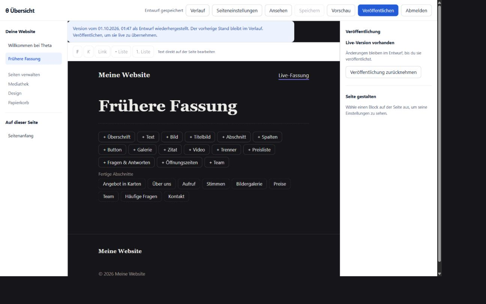

# Nachprüfung des Editors

Stand: 1. Oktober 2026. Geprüft wurde die mit PR #18 zusammengeführte Umsetzung auf Basis von `2efeec8`. Die Korrekturen liegen im Branch `fix/editor-reliability-review`.

## Gefundene und korrigierte Probleme

1. **Die Wiederherstellung konnte den jüngsten Entwurf verlieren.** Das Laden einer alten Version ersetzte sofort den lokalen Inhalt. Anschließend konnte Autosave den jüngsten Verlaufseintrag derselben Person überschreiben. Nicht gespeicherte letzte Eingaben verschwanden bereits beim Wechsel. Der Fehler wurde mit einer isolierten Datenbank reproduziert.

   Jetzt wird zuerst der aktuelle Entwurf einschließlich letzter Eingaben gesichert, danach die gewählte Fassung als eigene manuelle Speicherung übernommen. Beide Schritte belegen gemeinsam einen Platz in der Speicherwarteschlange. Eine Veröffentlichung kann nicht dazwischen laufen. Die Oberfläche übernimmt die historische Fassung erst nach erfolgreichem Abschluss und verhindert währenddessen weitere Eingaben. Scheitert der erste Schritt, bleibt der lokale Text erhalten. Scheitert der zweite, bleibt die erste Sicherung bestehen und eine Wiederholung nutzt deren neue Serverversion. Die öffentliche Fassung ändert sich dabei nicht. Es gilt weiterhin die Grenze von 50 Verlaufseinträgen.

2. **Eine fehlerhafte HTTP-200-Antwort konnte als erfolgreiche Speicherung gelten.** Der Editor übernahm zuvor ungeprüft den JSON-Inhalt. Jetzt müssen Seitenidentität, Typ, Version und die erforderlichen Felder stimmen; auch die Blöcke werden geprüft. HTML, unvollständiges JSON, eine andere Seite oder ungültige Blöcke bestätigen keine Speicherung. Lokale Eingaben bleiben erhalten; die Fehlermeldung bietet einen neuen Versuch an. Falls der Server den Schreibvorgang bereits ausgeführt hat, seine Antwort aber verloren geht, kann der nächste Versuch einen Versionskonflikt melden. Das verhindert Überschreiben; automatische Wiederherstellung nach einem solchen Konflikt ist noch nicht enthalten.

3. **Die linke Navigation zeigte nach einer Wiederherstellung den ursprünglichen Seitentitel.** Die aktive Seite verwendet nun ihren aktuellen Entwurfstitel.

4. **Bei blockierten Vorschaufenstern fehlte eine Alternative.** Nach erfolgreichem Speichern erscheint dann ein direkt anklickbarer Link zur geschützten Vorschau. Dieser zusätzliche Pfad wurde im Code geprüft; die Browserprüfung unten hat keine Popup-Blockade simuliert.

## Prüfung

- `bun run typecheck`: erfolgreich.
- `bun test`: 160 Tests erfolgreich. Sechs neue Regressionstests prüfen Wiederherstellung mit gesicherten und ungesicherten Eingaben, Reihenfolge gegenüber Veröffentlichung, Konflikt vor der Sicherung, Fehler nach erfolgreicher Sicherung und ungültige Erfolgsantworten.
- Bestehende Tests prüfen Migration älterer Datenbanken, getrennte öffentliche Fassungen in HTML/RSS/Sitemap/Export, veraltete Schreibversuche, geschützte Vorschau, Papierkorb, Medienverweise, Abschnittsgruppen, eigene Vorlagen und Bildfokuspunkte.
- Browserprüfung mit frischer In-Memory-Datenbank auf Desktop und Mobilgerät: alte Fassung laden; vorherigen Text im Verlauf nachweisen; Live-Fassung unverändert lassen; Navigationstitel prüfen; fehlerhafte HTTP-200-Speicherantwort simulieren; lokalen Text erhalten; erneut speichern; ausdrücklich veröffentlichen; danach wieder eine alte Fassung als Entwurf laden. Die öffentliche Route liefert weiter den zuletzt veröffentlichten Text. Keine Warnungen oder Fehler in der Browserkonsole.
- Die vorhandene `theta.db` und ihre Uploads wurden nicht für diese Prüfung geöffnet oder verändert. Ein Test mit einer Kopie der konkreten bestehenden Website steht noch aus.

## Nächste Schritte

1. **Korrekturen übernehmen.** Den Korrektur-PR nach erfolgreicher CI zusammenführen. Vor einem Update die gestoppte Website samt Datenbank und Uploads sichern. Den wichtigsten Ablauf anschließend auf einer Kopie der bestehenden Website prüfen: bearbeiten, veröffentlichen, Verlauf wiederherstellen und exportieren.
2. **Vollständiges Backup und Restore.** Ein konsistentes Backup von SQLite und Uploads anbieten, einschließlich Entwürfen, Live-Fassungen, Verlauf, Papierkorb, Einstellungen und eigenen Vorlagen. Konten sollen sich wiederherstellen lassen; aktive Sitzungen sollen danach ungültig sein. Erst eine erfolgreiche Wiederherstellung in ein leeres Ziel bestätigt die Sicherung. Der HTML-Export erfüllt diesen Zweck nicht.
3. **Lokale Entwürfe wiederfinden.** Ungespeicherte Eingaben bei Netzwerkfehlern und Versionskonflikten lokal aufbewahren und nach einem Neuladen zur Wiederaufnahme anbieten. Dafür Seitenidentität und Serverversion mit speichern, klare Auswahl zwischen lokalem und Serverstand anbieten und lokale Kopien nach erfolgreicher Übernahme entfernen. Derzeit bleiben solche Eingaben nur im geöffneten Tab erhalten.
4. **Wichtige Browserabläufe automatisieren.** Speichern während weiterer Eingaben, Wiederherstellung, Konflikt in zwei Tabs, Zwischenablage, Cursor/Undo, Abschnittsbewegung und mobile Bedienung als kleine dauerhafte Browser-Testsuite ergänzen. Die momentanen automatisierten Tests ersetzen diese Interaktionsprüfung nicht vollständig.
5. **Danach gezielte Komfortfunktionen.** Mediathek mit Suche und Filtern, verständlichere Verlaufseinträge sowie zeitlich begrenzte Freigabe-Vorschau priorisieren. Adressänderungen mit Weiterleitungen gesondert planen. Rollen, Zeitplanung, Mehrsprachigkeit und Plugins erst anhand konkreter Anforderungen ergänzen.

Entwürfe und Veröffentlichung funktionieren für Seiten und Beiträge. Allgemeine Website-Einstellungen und Designänderungen werden weiterhin unmittelbar öffentlich übernommen. Die Nachprüfung ist eine gezielte Funktions- und Datenverlustprüfung; sie ersetzt keinen vollständigen Sicherheits- oder Lasttest.
