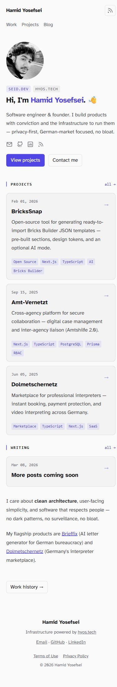

# seid.dev als Theta-Testwebsite

Bearbeitbarer Nachbau der Website des Projektinhabers, anhand von [seid.dev](https://seid.dev/) am 1. Oktober 2026. Inhalte werden als normale Theta-Seiten und Blöcke gespeichert. Der öffentliche Auftritt bleibt HTML und CSS ohne JavaScript.

## Starten und bearbeiten

Im Theta-Projektordner:

```sh
bun install
bun run demo:seid
```

Die Website öffnest du unter http://127.0.0.1:3108, den Editor unter http://127.0.0.1:3108/edit. Beim ersten Start erscheint ein einmaliger Einrichtungs-Link im Terminal. Lege darüber dein eigenes Konto an; die Demo enthält kein vorgegebenes Passwort. Nach einem Neustart ohne eingerichtetes Konto wird ein neuer Link erzeugt. `THETA_DEMO_PORT` erlaubt einen anderen Port.

Die Daten liegen ausschließlich in `examples/seid/data/theta.db` und `examples/seid/data/uploads/`. Das Beispiel ignoriert `THETA_DB` und `THETA_UPLOADS`, damit die reguläre Website unberührt bleibt. Weitere Starts behalten deine Änderungen. Eine Datenbank ohne Demo-Kennzeichnung wird vor Migrationen abgewiesen. Datenbank und Uploads gehören für ein Backup zusammen; kopiere sie bei gestopptem Server.

Texte bearbeitest du direkt auf der Seite. Nach einer Sekunde ohne Änderungen speichert Theta den Entwurf; **Veröffentlichen** übernimmt ihn für Besucher. Profil-Links, Porträt, Darstellung, Datumsfelder und Tags findest du rechts in den Block-Einstellungen. Den Arbeitsverlauf bearbeitest du auf „Work“, Projekttexte auf den jeweiligen Detailseiten. Projektkarten auf Startseite und Übersicht sind eigenständige, bearbeitbare Inhalte; sie werden nicht automatisch aus Detailseiten erzeugt.

## Inhalt und Adressen

| Original | Theta-Demo |
|---|---|
| `/` | `/` — Profil, drei Projekte, Writing, Kurzvorstellung |
| `/work` | `/work` — vier Stationen als Timeline |
| `/projects` | `/projects` — vier Projektkarten |
| `/projects/project-4` | `/brickssnap` |
| `/projects/project-3` | `/amt-vernetzt` |
| `/projects/project-2` | `/dolmetschernetz` |
| `/projects/project-1` | `/brieffix` |
| `/blog` | `/blog` |
| Blogbeitrag „More posts coming soon“ | `/blog/more-posts-coming-soon` |
| `/rss.xml` | `/blog/feed.xml` |
| `/terms-of-use` | `/terms-of-use` |
| `/privacy-policy` | `/privacy-policy` |

Der Beitrag behält das Veröffentlichungsdatum 8. März 2026. Englisch ist als öffentliche Sprache eingestellt; der Editor bleibt deutsch.

## Design und bewusste Abweichungen

Das wiederverwendbare Design „Portfolio“ übernimmt den hellen Hintergrund, den violetten Akzent, die Atkinson-Schrift, das runde Porträt und die kompakten Karten. Der Nachbau verwendet Thetas Blocksystem mit einer Profilvariante des Titelbilds sowie Listen- und Timeline-Varianten der Spalten. Es wird kein beliebiges HTML oder CSS in der Datenbank gespeichert.

Schriften und Porträt werden lokal ausgeliefert. Die Schriftdateien stammen von seid.dev; die SIL Open Font License liegt in `src/theme/fonts/atkinson-LICENSE.txt` und wird in den statischen Export übernommen. Der Upstream-Lizenztext stammt aus dem [Atkinson-Repository](https://github.com/googlefonts/atkinson-hyperlegible/blob/main/OFL.txt). Das Porträt und die Texte gehören zum Testauftrag des Website-Inhabers und sind keine frei lizenzierten Beispielinhalte für andere Websites.

Theta verwendet flache Seitenadressen und eigene Blog- und RSS-Adressen. Der BricksSnap-Link führt zum verifizierten Repository des Inhabers. Die Suche und der interaktive Hell/Dunkel-Umschalter des Originals sind nicht enthalten. Hell, Dunkel oder System stellst du unter „Design“ ein. Abstände, Fußzeile und mobile Anordnung folgen dem gemeinsamen Theta-Renderer. Dies ist eine lokale Testwebsite; das Original wurde nicht ersetzt oder neu bereitgestellt.

## Exportieren

```sh
bun run demo:seid:export
```

Der Export liegt in `examples/seid/export/` und enthält die veröffentlichten Seiten, RSS, Sitemap, CSS, Schriftlizenzen, Schriften und das Porträt. Er verwendet `https://seid.dev` als kanonische Adresse, lädt aber nichts auf diese Domain hoch. Das Beispiel erzeugt derzeit 21 Dateien. Für eine andere Zieladresse kannst du die Exportadresse in `run.ts` anpassen. Datenbank, Konten, Entwürfe und Versionsverlauf sind nicht Teil des HTML-Exports.

## Prüfung

Automatische Tests prüfen Eingabevalidierung, sichere Links und hervorgehobene Texte, die importierten Seiten, Veröffentlichungssprache, ursprüngliches Beitragsdatum, Schutz bestehender Inhalte, Entwurf/Live-Trennung sowie vollständigen Export mit Schriftlizenzen. Die bestehende Testsuite und Typprüfung laufen ebenfalls durch.

Im Browser geprüft: Startseite, Projektübersicht und Detailseite, Arbeitsverlauf, Blogübersicht und Beitrag sowie die Darstellung bei 390 Pixel Breite ohne horizontales Scrollen. In einer getrennten Testdatenbank wurden Profiltext und Tags geändert, automatisch gespeichert und veröffentlicht; danach wurde die Importfassung als Entwurf geladen, während die zuvor veröffentlichte Fassung live blieb. Die dauerhafte Demo enthält diese Teständerungen nicht.




## Dateien

- `content.ts`: Texte, Projektinformationen und Arbeitsverlauf vom Original.
- `portrait.webp`: Porträt vom Original.
- `seed.ts`: einmaliger Import über Thetas normale Speicher- und Medienfunktionen; verweigert bestehende Inhalte.
- `run.ts`: isolierter Demo-Server und statischer Export.
- `../../src/theme/portfolio-css.ts`: gemeinsame Präsentation für das Portfolio-Design.
